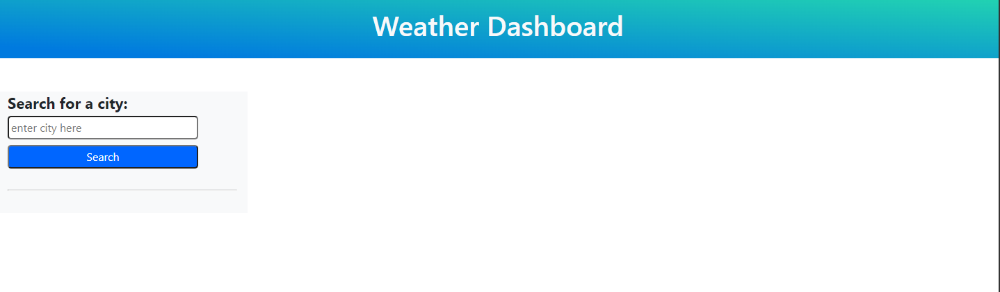
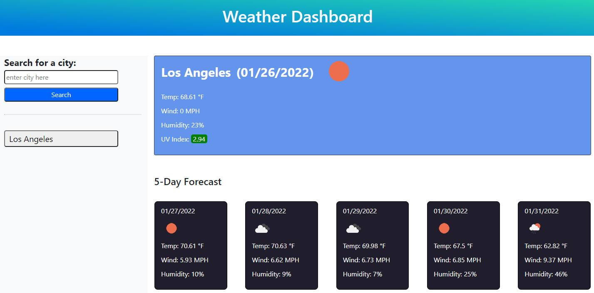
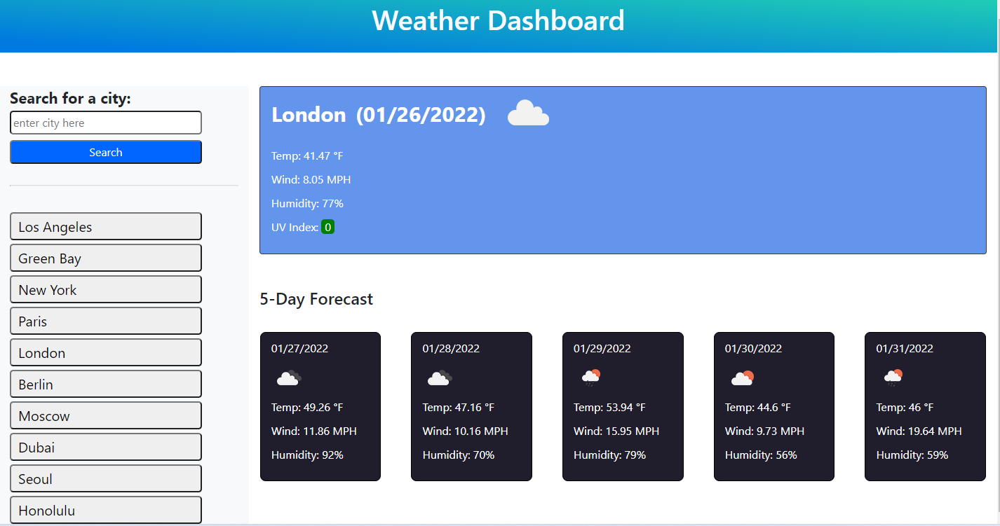

# The-Weather-Dash

(Homework-6: Server Side API's: Weather Dashboard)

 

## Project Description: 

Even numbered week homework assignment. This weeks homework assignment required us to create a weather dashboard from scratch using a server side API's weather data. Multiple API's from OpenWeatherMap had to be utilized to obtain the information required in the assignment.

  

## Table of Contents:

 

- [Installation] (#installation)
- [Usage] (#usage)
- [Credits] (#credits)
- [License] (#license)
- [Badges] (#badges)
- [Features] (#features)
- [How] (#how to contribute)
- [Criteria] (#criteria's met)
- [HTML] (#html - details)
- [CSS] (#css - details)
- [URL] (#url (github repository))
- [URL] (#url (published webpage))

 

## Installation
 
** Go to <a href="https://jasonjayoo.github.io/The-Weather-Dash/" target="_blank">The-Weather-Dash</a> In order to view The-Weather-Dash Webpage.

 
 

## Usage: screenshots - (Highlighted Title(s) = a hyperlink to the direct image)

 
 

[Screenshot1](images/Screenshot1.png)  "The initial page when loaded - A city name has to be entered in order for the data and styles to render"

 

[Screenshot2](images/Screenshot2.png)  "With just one city searched - current and future five day forecast renders in the browser"

 

[Screenshot3](images/Screenshot3.png)  "Ten cities searched and saved - "NOTE" London's weather data which is in the middle of the searched list history is showing in the browse. Proving that the search results buttons work when clicked, the specific city's weather data will re-render in the browser.

 
 

## Credits:

 

- My classmates: Marcus Lewis and Tyler Welker were indespensible collaborators during the development of this weather dashboard. When I got stuck in making the searched results buttons re-render the data Marcus was instrumental in coming up with a solution. Learned from him that .childElementCount existed! Tyler was instrumental in getting my application to hide most of the HTML and Styles until the user inputs a city name, along with many other details. I thank them both for their contribution to my web development growth.  

 

- I would also like to thank my tutor Mr. Faran Navazi for always guiding me toward a better method of developing my coding. He was crucial to helping me understand how to integrate multiple API's in order to obtain the specific data for a specific city.  

 

- Furthermore, I used the BCS Learning Assistants for the first time and they were very helpful in assisting me with resolving small sections of problems that I ran into during the development of this application. 

 
 

## License:
 
    -  MIT License - Copyright (c) 2022 Jason Yoo
 
 

## Badges:
 
    - UCI Full Stack Bootcamp
 
 

## Features:
 
    - Looking at the assignment from the top down
     
     
    - The first hurdle was to integrate the coordinates from the current weather API and linking it with the OneCall API's data.
     
     
    - When the page initially loads, the browser will only render the search bar. Once the user inputs a city name it will render all the weather information and stylizations that come with them. 
     
     
    - The most recently searched cities data will render in the top row with the city's name, todays data, an weather icon indicating the conditions along with the temperature, windspeed, humidity levels and UV index that renders either green(favorable), yellow(moderate), red(severe).
     
     
    - Then below that, a second row displays a five day forecast for the following five days for the city thats on display above. The five day forecast shows the future date, a weather icon indicating the kind of weather they will have that day, and that days forecasted temperature, windspeed and humidity.
     
     
    -Lastly the search results of the different cities weather info can be seen again by the user if they just click on the specific city they want to revisit. 
     
     
    - Upon refreshing of the page all the store city's results will be erased from the localstorage an browser. 

 
 

## How to Contribute:
 
    - My github repository is publically viewable. If you would like to contribute to the webpage please email me at jasonjayoo@outlook.com with the request and I will add you as a contributor on the repo. 
 
 

## Tests:
 
    - Try the weather app yourself and check out your city or any city's weather information!. 
     
     
    - You can test out the webpage on vsc or directly in the inspect window of your browser (f12). 

 
 

## Criteria's met: 

 

1. The Weather Dash meets the criteria's listed in the assignment.
    - When a user searched a city they are presented with the current an future weather conditions for that city and that city is added to the search history
    - The user is presented with the city's name, the date, an icon that represents the weather conditions, the current temperature, humidity, windspeed, and UV Index (which is displayed with different colors [Green = Favorable] [Yellow = Moderate] [Red = Severe]).
    - Below the current weather information the user is also shown a future five day forecast that give them the future date, an icon depicting the forecasted weather condtions, that days forecasted temperature, windspeed and humidity.
    - When the user clicks on a city in the search history, that specific cities weather data and future forecast is re-displayed in the browser. 

 
 

## HTML - Details:

1. The HTMl includes bootstrap, fontawesome and googleapi links in the head.

2. The HTML was created from scratch.

3. The components for the structure of the webpage was made for the most part in the html with the exception of the search history buttons and the data was dynamically added.

4. Althought a script tag link for jQuery is included at the bottom, for the majority of this assignments code I wrote it in vanilla javascript.

5. ALT-0176 created the degree symbol for the temperature. 

 
 

## CSS - Details:

1. Bootstrap was mainly used for its grid system and some stylizations. 

2. A moderate amount of direct CSS overrides were added so I could better uniquely style the application. 

 
 

## JS - Details:

1. The first step was to create all the variables to link the HTML elements to the Javascript. Then link the search bar to an event listener in order to store the city's name in the local storage and added to the search history list.

2. The next step was to create an account with OpenWeatherMap and obtain an API Key.

3. With the API key I created a function that obtained the data from the API via a URL request. The data(s) for the coordinates had to be fetched first then linked via the lat and lon variables to the OneCall API to obtain the weather data for specific cities. Then specific data for the weather icon, temperature, windspeed, humidity and uvIndex was retrieved from the mass of data available. 

4. Next, I created three seperate if conditions so that if the uvIndex's number came back as less than or equal to 3 it would render green for 'favorable, if it was between 3 and 5 in would render yellow for 'moderate' and if it was greater than 5 it would render red for 'severe'.

5. Then the future five day forecast was tackled. I tried using a third API the 5Day but the icons came back as a twelve hour different and showed night conditions during the day so I chose to use the daily data from the OneCall API instead. All the dates uses .moment. And the dates correlate with the future forecasts buy starting with the [1] from the daily's data array index. The future days weather icon, temperature, windspeed, and humidity where obtained from the API with specific calls and linked to the DOM.

6. The last and one of the most difficult tasks was to link the search history buttons correctly so that it would re-render the previously searched city's weather information. First the the local storages search history was retrieved via a for loop, then buttons for each city was created dynamically. Those buttons where then linked to a searchHistoryList index which is linked to the variable searchedCityList that obtained the stored search list from the local storage. Then another for loop was created to loop through the buttons via cityList.childElementCount. If the cityList's children (aka: search history list of citys) exists then the event listener would look for the specific city button the user clicked in order to re-render that specific city's weather information.

 
 

## URL (Github Repository):

Click [here](https://github.com/jasonjayoo/The-Weather-Dash) to go to the The-Weather-Dash Github Repository

 

## URL (Published Webpage):

<a href="https://jasonjayoo.github.io/The-Weather-Dash/" target="_blank">The-Weather-Dash</a>
